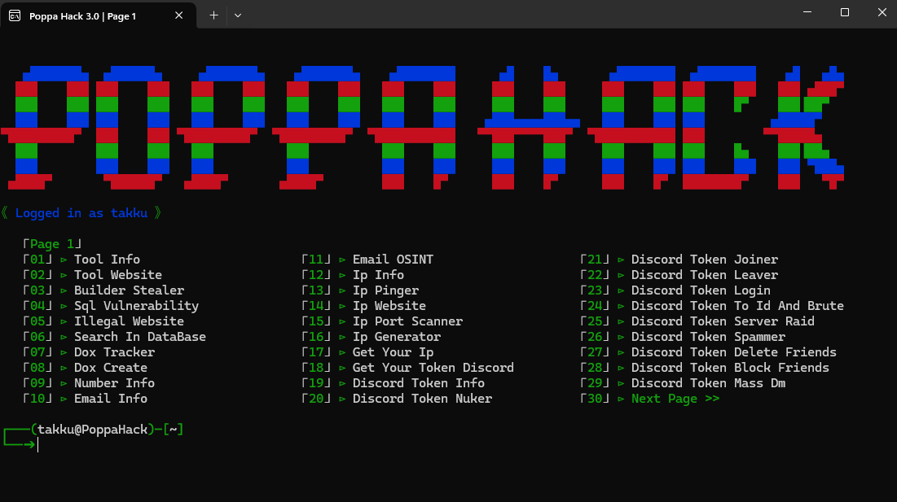

<h1 align="center">PoppaHack</h1> 
<p align="center">

</p>

<p align="center">
  
```
   ▄███████▄  ▄██████▄     ▄███████▄    ▄███████▄    ▄████████      ▄█    █▄       ▄████████  ▄████████    ▄█   ▄█▄
  ███    ███ ███    ███   ███    ███   ███    ███   ███    ███     ███    ███     ███    ███ ███    ███   ███ ▄███▀
  ███    ███ ███    ███   ███    ███   ███    ███   ███    ███     ███    ███     ███    ███ ███    █▀    ███▐██▀
  ███    ███ ███    ███   ███    ███   ███    ███   ███    ███    ▄███▄▄▄▄███▄▄   ███    ███ ███         ▄█████▀
▀█████████▀  ███    ███ ▀█████████▀  ▀█████████▀  ▀███████████   ▀▀███▀▀▀▀███▀  ▀███████████ ███        ▀▀█████▄
  ███        ███    ███   ███          ███          ███    ███     ███    ███     ███    ███ ███    █▄    ███▐██▄
  ███        ███    ███   ███          ███          ███    ███     ███    ███     ███    ███ ███    ███   ███ ▀███▄
 ▄████▀       ▀██████▀   ▄████▀       ▄████▀        ███    █▀      ███    █▀      ███    █▀  ████████▀    ███   ▀█▀
```
<p>
</p>
<h1>Description:</h1>
<p>
  
Developed in <strong>Python</strong>.<br>
Tool in <strong>English</strong>.<br>
Available on <strong>Windows</strong> and <strong>Linux</strong><br>
<strong>Open Source</strong> only for verification, ensuring no viruses or malicious programs.<br>
<strong>Frequently updated</strong>.<br>
</strong>Free</strong> for everyone.<br>
</p>

<h1>Functions:</h1>
<p align="center">
  
```
   ⌈Page 1⌋
   ⌈01⌋ ⊳ Tool Info                      ⌈11⌋ ⊳ Email OSINT                    ⌈21⌋ ⊳ Discord Token Joiner
   ⌈02⌋ ⊳ Tool Website                   ⌈12⌋ ⊳ Ip Info                        ⌈22⌋ ⊳ Discord Token Leaver
   ⌈03⌋ ⊳ Builder Stealer                ⌈13⌋ ⊳ Ip Pinger                      ⌈23⌋ ⊳ Discord Token Login
   ⌈04⌋ ⊳ Sql Vulnerability              ⌈14⌋ ⊳ Ip Website                     ⌈24⌋ ⊳ Discord Token To Id And Brute
   ⌈05⌋ ⊳ Illegal Website                ⌈15⌋ ⊳ Ip Port Scanner                ⌈25⌋ ⊳ Discord Token Server Raid
   ⌈06⌋ ⊳ Search In DataBase             ⌈16⌋ ⊳ Ip Generator                   ⌈26⌋ ⊳ Discord Token Spammer
   ⌈07⌋ ⊳ Dox Tracker                    ⌈17⌋ ⊳ Get Your Ip                    ⌈27⌋ ⊳ Discord Token Delete Friends
   ⌈08⌋ ⊳ Dox Create                     ⌈18⌋ ⊳ Get Your Token Discord         ⌈28⌋ ⊳ Discord Token Block Friends
   ⌈09⌋ ⊳ Number Info                    ⌈19⌋ ⊳ Discord Token Info             ⌈29⌋ ⊳ Discord Token Mass Dm
   ⌈10⌋ ⊳ Email Info                     ⌈20⌋ ⊳ Discord Token Nuker            ⌈30⌋ ⊳ Next Page >>

   ⌈Page 2⌋
   ⌈31⌋ ⊳ << Previous Page               ⌈41⌋ ⊳ Discord Nitro Generator
   ⌈32⌋ ⊳ Discord Token Delete Dm        ⌈42⌋ ⊳ Discord Webhook Info
   ⌈33⌋ ⊳ Discord Token Status Changer   ⌈43⌋ ⊳ Discord Webhook Delete
   ⌈34⌋ ⊳ Discord Token Language Changer ⌈44⌋ ⊳ Discord Webhook Spammer
   ⌈35⌋ ⊳ Discord Token House Changer    ⌈45⌋ ⊳ Discord Webhook Generator
   ⌈36⌋ ⊳ Discord Token Theme Changer    ⌈46⌋ ⊳ Roblox Cookie Login
   ⌈37⌋ ⊳ Discord Token Generator        ⌈47⌋ ⊳ Roblox Cookie Info
   ⌈38⌋ ⊳ Discord Bot Server Nuker       ⌈48⌋ ⊳ Roblox User Info
   ⌈39⌋ ⊳ Discord Bot Invite To Id       ⌈49⌋ ⊳ Roblox Id Info
   ⌈40⌋ ⊳ Discord Server Info

┌───(takku@PoppaHack)─[~]
└──➔
```
</p>

<h1>🔒・Requirements:</h1>
<h3>Windows:</h3>
<p>
- You need to install <a href="https://www.python.org/downloads/">Python</a> with the <a href="Img/pythonpath.png">PATH</a> option.<br>
- Windows 10 & 11
</p>
<h1>Installation:</h1>
- Launch "Setup.bat" or "Setup.py"
</p>

<h2>Credits:</h2>
<p>
- Creator: PoppaMies<br>
- Version: 3.0
</p>
